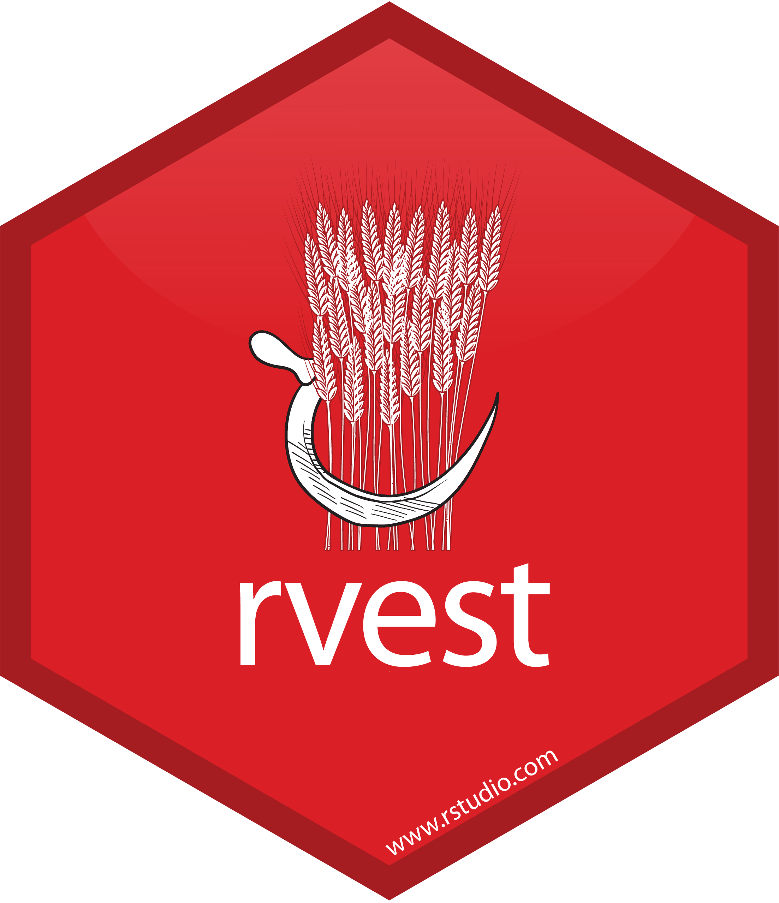

# Inhalt

```{r mysetup, include = FALSE}
options(htmltools.dir.version = FALSE)

if(!require("pacman")) install.packages("pacman")
p_load(tidyverse, rvest, httr, robotstxt, qdap, janitor, lubridate,
       knitr, kableExtra, cowplot, eurostat, ggrepel, rzeit2)
```

1. Einleitung
2. Web Scraping
    + Grundlagen
    + Web Scraping in R
        + a) Generelles Schema
        + b) Spezielle Technologien
    + Rechtliche & ethische Aspekte
3. Fragen aus den Projekten
4. Ausblick & Weiterlernen

---

# Zur Präsentation

- Folien sind online verfügbar: https://github.com/FabianFox/Webscraping-FAU-Slides
- Beispiele auf [GitHub](https://github.com/FabianFox/Webscraping-FAU-/tree/master/code)
- Benötigte Pakete über: 

```{r setup, echo = TRUE, eval = FALSE}
install.packages(pacman) # Installation nur einmal notwendig
library(pacman)
p_load(tidyverse, httr, robotstxt, qdap, janitor,
       devtools, lubridate, rzeit2)
```

---

# 1. Einleitung

> If programming is magic, then *web scraping* is wizardry ([Mitchell 2015: vii](https://www.oreilly.com/library/view/web-scraping-with/9781491985564/))

Ziel des Workshops:

- TeilnehmerInnen in die arkane Kunst des Web Scrapings einführen
    - eigene (kleine) Projekte umsetzen
    - Tools kennenlernen
    - Weiterlernen ermöglichen

---

# Sinkende Ausschöpfungsquoten

- Ausschöpfungsquoten repräsentativer Umfragen sinken drastisch ([Farrell/Petersen 2010: 116f.](https://onlinelibrary.wiley.com/doi/full/10.1111/j.1475-682X.2009.00318.x#))
- Ausschöpfungsquote im ALLBUS ([Schwemmer 2019](https://github.com/cschwem2er/allbus_responserates))

```{r response_rate_fig, echo = FALSE, out.width = "80%"}
# Source: Schwemmer (2019) https://github.com/cschwem2er/allbus_responserates

```

---

# Internetnutzung

```{r internet_use_fig, echo = FALSE, eval = TRUE, out.width = "60%", out.height = "60%", dpi = 300}
get_eurostat("isoc_r_iacc_h", time_format = "date",
                          stringsAsFactors = FALSE, filters = 
                            list(geo = "DE")) %>%
  mutate(time = strtoi(str_extract(time, "[:digit:]{4}")),
         highlight = ifelse(time %in% c(2006, 2018), paste0(values, "%"), "")) %>%
  ggplot(aes(x = time, y = values)) +
  geom_line(stat = "identity", size = 1, color = '#377eb8') +
  geom_point(stat = "identity", size = 4, color = '#377eb8') +
  geom_text_repel(aes(label = highlight), vjust = -1.05, nudge_y = 1) +
  scale_y_continuous(labels = function(x) paste0(x, "%")) +
  scale_x_continuous(breaks = seq(2006, 2020, 2)) +
  labs(x = "", y = "", 
       title = "Anteil der Haushalte in Deutschland mit Internetzugang",
       caption = "Quelle: Eurostat (Variable: isoc_r_iacc_h)") +
  theme_minimal() +
  theme(panel.grid.minor.x = element_blank(),
        panel.grid.major.x = element_blank(),
        text = element_text(size = 12),
        axis.ticks = element_line(size = .5))
```

Quelle: [Eigene Darstellung](https://github.com/FabianFox/Webscraping-FAU-/blob/master/code/internet_use_de_eurostat.R)

---

# Digitale Daten

> "...something big is going on" ([Salganik 2018: 2](https://www.bitbybitbook.com/en/1st-ed/preface/))

- Übergang vom analogen zum digitalen Zeitalter
    - kommende Krise der empirischen Soziologie ([Savage & Burrows 2007](https://journals.sagepub.com/doi/10.1177/0038038507080443#articleShareContainer))?
    - neue Möglichkeiten und/oder Gefahren ([Salganik 2018: 17-41](https://www.bitbybitbook.com/en/1st-ed/observing-behavior/characteristics/))
    
> "'computational social science' (CSS) is occurring. The question is whether
> it happens with or without social scientists" ([Heiberger & Riebling 2016: 1](https://journals.sagepub.com/doi/abs/10.1177/2059799115622763))

---

# Digitale Daten

.pull-left[

- positiv: big, always-on, nonreactive
- negativ: incomplete, inaccessible, nonrepresentative, drifting, algorithmically 
confounded, dirty, sensitive

Quelle: [Salganik 2018: 17-41](https://www.bitbybitbook.com/en/1st-ed/observing-behavior/characteristics/)

]

.pull-right[

```{r salganik_book, echo = FALSE, out.width = "80%"}

```


]

---

# Technologien des WWW

.pull-left[

Infrastruktur des Internets im Alltag unsichtbar.

Unser Browser übernimmt:

- Serveranfragen (Request/Response-Paar: **HTTP**)
- Darstellung von **HTML**, **CSS** und **JavaScript**
- weitere Technologien: AJAX, PHP, SQL... ([Munzert et al. 2015](http://r-datacollection.com/))

Um Informationen gezielt abzufragen, benötigen wir allerdings basale Kenntnisse 
der zugrundeliegenden Technologien.

]

.pull-right[

```{r greer_fig, echo = FALSE, out.width = "80%"}
# Source: https://davegreer.cc/INTERNET

```

]

---

# Beispielprojekt: Studium.org

- Informationen über Studienorte (Einwohnerzahl, Semesterticket (€), Anzahl d. Kinos...) 

```{r studium_org_fig, echo = FALSE, out.width = "70%"}
# Source: studium.org

```

Quelle: [studium.org](https://www.studium.org/erziehungswissenschaft/erlangen-n%C3%BCrnberg)

---

# HTTP

**H**yper**t**ext **T**ransfer **P**rotocol [(HTTP)](https://en.wikipedia.org/wiki/Hypertext_Transfer_Protocol)

```{r http_fig, echo = FALSE, out.width = "50%"}
# Source: https://code.tutsplus.com/tutorials/http-the-protocol-every-web-developer-must-know-part-1--net-31177

```

- Übertragungsprotokoll, welches aus zwei Teilen besteht:

    - Request (Client)
    - Response (Server)

---

# URL

- Requests erfolgen über **U**niform **R**esource **L**ocators [(URL)](https://en.wikipedia.org/wiki/URL)
    
```{r url_fig, out.width = "100%", echo = FALSE}
# Source: Evans, Julia (2019) "HTTP learn your browser's language"

```

Quelle: [Evans (2019)](https://jvns.ca/blog/2019/09/12/new-zine-on-http/)

---

# URL

- URL kann in Schleifen genutzt werden, um über Seite zu springen

```{r url_loop_fig, out.width = "85%", echo = FALSE}
# Source: own

```

---

# Beispiel: HTTP

- `GET`-Abfrage mit `httr::GET` und Antwort des Servers in R

```{r, echo = TRUE, eval = TRUE}
# install.packages("httr")
p_load(httr)
response <- GET("https://www.studium.org/erziehungswissenschaft/suche/?view=uni") %>%
  print()
```

---

# Beispiel: HTTP

```{r response_fig, out.width = "100%", echo = FALSE}
# Source: own

```

- [Status codes](https://en.wikipedia.org/wiki/List_of_HTTP_status_codes)

    - 2XX : Success
    - 3xx : Redirect
    - 4xx : Client-Error
    - 5xx : Server-Error

---

# Beispiel: HTTP

```{r http_example, echo = TRUE, eval = TRUE, message = FALSE, warning = FALSE}
study.df <- response %>% 
  read_html() %>% 
  html_nodes(".fs3.mr_1b") %>%
  html_text() %>%
  tibble(studienort = .)
```

- [Code](https://github.com/FabianFox/Webscraping-FAU-/blob/master/code/pedagogy_programs_example.R) zur Grafik

```{r http_example_fig, echo = FALSE, eval = TRUE, out.width = "45%", dpi = 300}
studienort.fig <- study.df %>%
  count(studienort) %>%
  mutate(studienort = str_to_title(tolower(studienort))) %>%
  ggplot(aes(x = studienort, y = n)) +
  geom_bar(stat = "identity") +
  labs(x = "", y = "", 
      title = "Erziehungswiss. Studiengänge im deutschsprachigen Raum",
      caption = "Quelle: studium.org") +
  theme_minimal() +
  theme(axis.text.x = element_text(angle = 45, hjust = 1), 
        panel.grid.minor.x = element_blank(),
        panel.grid.major.x = element_blank(),
        text = element_text(size = 10),
        axis.ticks = element_line(size = .5))

studienort.fig
```

---

# HTML

- **H**yper**t**ext **M**arkup **L**anguage [(HTML)](https://www.w3schools.com/html/default.asp)

    - einfacher Text mit zusätzlichen Anweisungen (Tags, Attributes...)
    - wird vom Browser interpretiert und dargestellt
    
- HTML-Code ist über die Webentwicklungstools des Browsers verfügbar
    - Rechtsklick -> Seitenquelltext anzeigen
    - Aufschluss über verfügbare Informationen

```{r sourcecode_fig, out.width = "90%", echo = FALSE}
# Source: own

```

---

# Beispiel: HTML I

Einfache Seiten über Editor/Notepad++ erstellbar:

```{r, eval = FALSE, echo = TRUE}
<!DOCTYPE html>
<html>

<head>
<title>Workshop: Web Scraping</title>
</head>

<body>
<h1> Web Scraping mit R, FAU Erlangen-Nürnberg</h1>
<p>Dieser Kurs f&uuml;hrt in das "Web Scraping" mit R ein. Er wird durch <a href="https://fguelzau.rbind.io/">Fabian G&uuml;lzau</a> geleitet.</p>

</body>
</html>
```

Der Browser interpretiert den Code und zeigt eine [Internetseite](http://htmlpreview.github.io/?https://github.com/FabianFox/Webscraping-FAU-/blob/master/code/HTML-Example.html) an.

---

# Beispiel: HTML II

HTML:

- besitzt eine Baumstruktur
- Markup-Elemente helfen uns Informationen zu lokalisieren (*Relationalität*)
    - **D**ocument **O**bject **M**odel [(DOM)](https://en.wikipedia.org/wiki/Document_Object_Model)
    - Darstellung von HTML in R (*parsing*)
    
```{r tree_structure, out.width = "85%", echo = FALSE}

```

---

# CSS

**C**ascading **S**tyle **S**heet [(CSS)](https://www.w3schools.com/css/default.asp)

- beinhaltet Informationen über den Stil der HTML-Seite
- kann genutzt werden, um Informationen zu lokalisieren (CSS-Selektoren)

```{r css_fig, out.width = "30%", echo = FALSE}
# Source: https://en.wikipedia.org/wiki/Cascading_Style_Sheets

```

---

# JavaScript

[JavaScript](https://www.w3schools.com/js/default.asp) (JS): "Programmiersprache des Internets"

- macht Internetseiten dynamisch
- Inhalte erscheinen erst nach Ausführung von JS 
    - problematisch für unsere Scraper
    - [Beispiel](https://artfacts.net/):

```{r java_fig, out.width = "50%", echo = FALSE}
# Source: artfacts.net

```

--- 

# 2a) Web Scraping in R: Generelles Vorgehen

Web Scraping-Projekte folgen einem generellen Schema:

1. Internetseite kennenlernen
2. Import von HTML-Dateien
3. Information isolieren
4. Iteration (Schritt 2&3 wiederholt ausführen)

```{r, out.width = "50%", echo = FALSE}
# Source: https://r4ds.had.co.nz/introduction.html
include_graphics("figures/data_science_wflow.PNG")
```

Quelle: [Wickham & Grolemund (2018)](https://r4ds.had.co.nz/introduction.html)

---

# Web Scraping in R

```{r, out.width = "8%", echo = FALSE}
# Source: http://hexb.in/

```

.pull-left[

1. Internetseite kennenlernen
2. Import von HTML-Dateien
3. Information isolieren
4. Iteration

]

--

.pull-right[

Das generelle Schema lässt sich in R über das Paket [`rvest`](https://github.com/hadley/rvest) umsetzen:

1. u.a. [`robotstxt`](https://github.com/ropensci/robotstxt)
2. `read_html`: Import von HTML/XML-Dateien
3. Information isolieren
    - `html_nodes`: Extrahiert Teile des HTML-Dokument mit Hilfe von XPath/CSS-Selektoren
    - `html_text` / `html_attr` / `html_table`: Extrahiert Text, Attribute und Tabellen
4. `map` (Paket: [purrr](https://purrr.tidyverse.org/)): Iteration

]

--

---

# Umsetzung in R: Studium.org

- Vorgehen (*decomposition*)
    - am Einzelfall erproben
    - dann über alle Seiten generalisieren

```{r, out.width = "65%", echo = FALSE}
# Source: BBC (https://www.bbc.co.uk/bitesize/topics/zkcqn39/articles/z8ngr82)

```

Quelle: [BBC (2019)](https://www.bbc.co.uk/bitesize/topics/zkcqn39/articles/z8ngr82)

---

# 1. Internetseite kennenlernen

Wichtige Punkte:

- statische oder dynamische Internetseite
    - statisch: [`rvest`](https://github.com/hadley/rvest)
    - dynamisch
        - [`RSelenium`](https://github.com/ropensci/RSelenium)
        - [`splashr`](https://github.com/hrbrmstr/splashr)
- Rechtliche Punkte
    - Terms of Service (ToS)
    - robots.txt
    - API
- Verhalten der URL beobachten

---

# Studium.org: Internetseite kennenlernen

Einzelne Punkte:

- Seitenquelltext: **statisch**
- HTML-Tags der Zielinformation: **.right**
- robots.txt / Terms of Service: **keine relevanten Beschränkungen**

```{r echo = TRUE, eval = TRUE}
paths_allowed(
  paths  = c("/erziehungswissenschaft"), 
  domain = c("studium.org")
)
```

---

# 2. Import von HTML-Dateien

Internetseiten müssen in ein Format übersetzt werden, welches von R gelesen und
bearbeitet werden kann (z.B. Baumstruktur).

Benötigt wird:

- URL 
- Request/Response-Paar

---

# Studium.org: Import von HTML-Seiten

Über `rvest::read_html`:

```{r echo = TRUE, eval = TRUE}
(html.page <- read_html("https://www.studium.org/erziehungswissenschaft/erlangen-n%C3%BCrnberg"))
```

---

# 3. Information isolieren

Zur Extraktion von Informationen nutzen wir die Baumstruktur der HTML:

- [XPath](https://www.w3schools.com/xml/xpath_intro.asp)
- [CSS-Selektoren](https://www.w3schools.com/csSref/css_selectors.asp)

```{r tree_fig2, out.width = "80%", out.height = "85%", echo = FALSE}
# Source: https://wiki.selfhtml.org/wiki/XML/Regeln/Baumstruktur
include_graphics("figures/trees_structure_2.PNG")
```

Quelle: [selfhtml.de](https://wiki.selfhtml.org/wiki/XML/Regeln/Baumstruktur)

---

# XPath und CSS-Selektoren: Tools

Wir konstruieren Selektoren selten manuell, da Anwendungen dies übernehmen:

- [Selector Gadget](https://selectorgadget.com/)
- Browser: [Webentwicklungstools](https://developer.mozilla.org/de/docs/Tools/Seiten_Inspektor)
- Lerntools: [CSS Diner](https://flukeout.github.io/)

---

# Studium.org: CSS-Selektor

Mit SelectorGadget lässt sich die gewünschte Information schnell "erklicken".

```{r node_example_print, echo = TRUE, eval = TRUE}
html.nodes <- html_nodes(html.page, css = ".right")
```

```{r node_example, echo = FALSE, eval = TRUE}
head(html.nodes, 4)
```

```{r selector_gadget, out.width = "80%", out.height = "40%", echo = FALSE}

```

---

# Studium.org: Umwandeln in Text/Tabelle

Wir sind selten am HTML-Tag interessiert, sondern an dem Inhalt:

```{r html_to_text, echo = TRUE, eval = TRUE}
html.text <- html.nodes %>%
  html_text()
```

```{r html_to_text_print, echo = FALSE, eval = TRUE}
head(html.text, n = 4)
```

---

# Datenaufbereitung: RegEx

.left-column[

```{r oreally_fig1, out.width = "95%", out.height = "95%", echo = FALSE}
# Source: https://boyter.org/2016/04/collection-orly-book-covers/

```

]

.right-column[

**Reg**ular **Ex**pression

- zur Suche von Ausdrücken (*patterns*) in Text (*strings*)
- in R z.B. über [`stringr`](https://stringr.tidyverse.org/index.html)
    - viele hilfreiche [Funktionen](https://rstudio.com/resources/cheatsheets/#work-with-strings-cheat-sheet) (u.a. `str_trim`, `str_replace`, `str_extract`)

```{r string_exm, echo = TRUE, eval = TRUE}
str_view(string = "Wichtig ist die Zahl 42!",
         pattern = "[:digit:]+")
```

]

---

# RegEx: Studium.org

Die Umfrageergebnisse liegen als "strings" vor, sodass wir sie für die Datenanalyse 
in numerische Werte umwandeln müssen.

```{r studium_regex, echo = TRUE, eval = TRUE}
html.text <- html.text %>%
  str_replace_all(., "(\\r|\\t|\\n)", "") %>%
  str_extract(., "[:digit:]+,|.[:digit:]+") %>%
  str_replace_all(., ",", ".") %>%
  str_trim(., side = "both") %>%
  enframe()
```

```{r regex_print, echo = FALSE, eval = TRUE}
html.text
```

---

# Vom Einzelfall zum Gesamtprojekt

Was benötigen wir, um Datensatz zu erstellen, der die Informationen für alle Universitäten enthält?

1. URLs zu den Einzelseiten (`html_attr("href")`)
2. Funktion, die die Einzelschritte generalisiert
3. Iteration über alle Seiten (`map`)
4. Datenaufbereitung ([`stringr`](https://stringr.tidyverse.org/), [`dplyr`](https://dplyr.tidyverse.org/))

```{r iteration_fig, out.width = "80%", echo = FALSE}
# Source: https://www.rstudio.com/resources/cheatsheets/#purrr

```

Quelle: [purrr-Cheatsheet](https://www.rstudio.com/resources/cheatsheets/#purrr)

---

# 1. URLs zu den Einzelseiten

```{r links, echo = TRUE, eval = TRUE}
# (A) Liste mit Links zu den Einzelseiten
url <- "https://www.studium.org/erziehungswissenschaft/uebersicht-universitaeten"

# (B) Node-Attribut mit Link ("href")
links <- url %>%
  read_html() %>%
  html_nodes(".lh1 a") %>%
  html_attr("href") %>%
  tibble(paste0("http://www.studium.org/", .)) %>%
  set_names(., nm = c("uni", "link"))
```

```{r glimpse_links, echo = FALSE, eval = TRUE}
head(links, n = 4)
```

---

# 2. Funktion erstellen

.pull-left[

```{r function_exm, echo = TRUE, eval = TRUE}
# Some data
test <- tibble(
  var1 = c(1, 3, 5, 9),
  var2 = c(5, 5, 5, 5)
)

# Function
perc_fun <- function(x){  # formals
  x / sum(x) * 100        # body
}

# Apply
map(test, perc_fun) # Loop
```

]

.pull-right[

```{r function_fig, out.width = "75%", echo = FALSE}
# Source: https://adv-r.hadley.nz/functions.html

```

Vertiefend: [Wickham 2019](https://adv-r.hadley.nz/functions.html)

]

---

# 2. Funktion erstellen (studium.org)

```{r function_apply, echo = TRUE, eval = TRUE}
steckbrief_fun <- function(x) {
  read_html(x) %>%           # (2) Import      # Body besteht
    html_nodes(".right") %>% # (3) Extrahieren # aus Einzelfall-
    html_text()              # (4) als Text    # Vorgehen
}

# Save scraping
save_steckbrief_fun <- possibly(steckbrief_fun, NA_real_)
```

Die Funktion `possibly` lässt die Schleife auch dann weiterlaufen, wenn ein Link nicht funktioniert ([s. Vignette](https://purrr.tidyverse.org/reference/safely.html)). 

---

# 3. Iteration über alle Seiten

```{r map_studium, echo = TRUE, eval = FALSE}
steckbrief.info <- map(.x = links$link, ~ {
  Sys.sleep(sample(seq(2, 5, by = .5), 1)) # friendly scraping
  save_steckbrief_fun(.x)
})
```

```{r glimpse_std, echo = FALSE, eval = TRUE}
steckbrief.info <- readRDS(file = "./data/steckbrief_info.rds")
head(pluck(steckbrief.info, 1), n = 4)
```

---

# 4. Datenaufbereitung

Daten sind als `list` in einem `tibble` (dataframe) gespeichert und nicht bereinigt.

Vorgehen:
- (A) Liste benennen
- (B) Liste in "long"-Format überführen 
- (C) Daten bereinigen (RegEx)
- (D) Variablennamen ergänzen

---

# Datenaufbereitung (A & B)

Vorgehen:
- **(A) Liste benennen**
- **(B) Liste in "long"-Format überführen**
- (C) Daten bereinigen (RegEx)
- (D) Variablennamen ergänzen

```{r cleaning_AB, echo = TRUE, eval = TRUE}
# (A) Liste benennen
names(steckbrief.info) <- str_extract_all(links$uni, "(?<=/)[:alpha:].*")

# (B) "long"-Format
uni.df <- steckbrief.info %>%
  enframe() %>%
  unnest()
```

```{r cleaning_AB_show, echo = FALSE, eval = TRUE}
head(uni.df, n = 4)
```

---

# Datenaufbereitung (C)

Vorgehen:
- (A) Liste benennen
- (B) Liste in "long"-Format überführen
- **(C) Daten bereinigen (RegEx)**
- (D) Variablennamen ergänzen

```{r cleaning_C, echo = TRUE, eval = TRUE}
# (C) Daten bereinigen
uni.df <- uni.df %>%
  mutate(value = 
           str_extract_all(value, "[:digit:]+,|.[:digit:]+") %>%
           map(., paste0, collapse = "") %>%
           unlist() %>%
           str_replace_all("\\.", "") %>%
           str_replace_all(., ",", "\\.") %>%
           parse_number()
  )
```

```{r cleaning_C_show, echo = FALSE, eval = TRUE}
head(uni.df, n = 4)
```

---

# Datenaufbereitung (D)

Vorgehen:
- (A) Liste benennen
- (B) Liste in "long"-Format überführen
- (C) Daten bereinigen (RegEx)
- **(D) Variablennamen ergänzen**

```{r cleaning_D, echo = TRUE, eval = TRUE}
# (D) Variablennamen ergänzen: Scrapen
var_names <- read_html(links$link[1]) %>%
  html_nodes(".rel.fs4") %>%
  html_text() %>%
  bracketX() %>%         # Cleaning
  tolower() %>%          # ...
  str_replace_all(.,     # ...
                  " ", 
                  replacement = "_") 

# ...: Ergänzen
uni.df <- uni.df %>%
  mutate(
    var_names = rep(var_names, length(unique(name)))
  ) 
```

```{r cleaning_D_show, echo = FALSE, eval = TRUE}
head(uni.df, n = 4)
```

---

# Ergebnis

```{r result_studium, echo = FALSE, eval = TRUE}
uni.df %>%
  slice(1:15) %>%
  kable() %>%
  kable_styling(bootstrap_options = "striped", full_width = F)
```

---

# Ergebnis: Visualisierung

- [Code](https://github.com/FabianFox/Webscraping-FAU-/blob/master/code/studium_org_erzw_scraper.R) zur Grafik

```{r studium_viz, echo = FALSE, eval = TRUE, out.width = "65%", out.height = "65%", dpi = 300}
uni.df %>% 
  filter(var_names == "sonnenstunden_pro_jahr") %>%
  ggplot() +
  geom_point(aes(fct_reorder(name, value), value), 
             stat = "identity") +
  labs(title = "Deutschsprachige Erzw.-Institute nach Sonnenstunden im Jahr",
       subtitle = paste0("Die Differenz zwischen Berlin und Erlangen-Nürnberg beträgt ", 
                         round(
                           abs(
                             uni.df$value[uni.df$name == "erlangen-nürnberg" & var_names == "sonnenstunden_pro_jahr"] -
                               uni.df$value[uni.df$name == "hu-berlin" & var_names == "sonnenstunden_pro_jahr"]),
                           digits = 1),
                         " Sonnenstunde im Jahr."),
       x = "", y = "", caption = "Quelle: studium.org") +
  geom_point(data = subset(uni.df, name %in% c("erlangen-nürnberg", "hu-berlin") & var_names == "sonnenstunden_pro_jahr"),
             aes(fct_reorder(name, value), value), 
             stat = "identity", color = "red", size = 4) +
  theme_minimal() +
  theme(axis.text.x = element_text(angle = 45, hjust = 1), 
        panel.grid.minor.x = element_blank(),
        panel.grid.major.x = element_blank(),
        text = element_text(size = 14),
        axis.ticks = element_line(size = .5))
```

---

# 2b. Spezielle Technologien

Spezielle Möglichkeiten & Herausforderungen:

[**A**pplication **P**rogramming **I**nterface: (API)](https://en.wikipedia.org/wiki/Application_programming_interface)

- **erleichtert** den Zugriff auf Daten über spezifische Schnittstellen
    - Beispiele: [Twitter](https://developer.twitter.com/en.html), [Die Zeit](http://developer.zeit.de/index/), [Eurostat](https://ec.europa.eu/eurostat/web/json-and-unicode-web-services), [Wikipedia](https://github.com/Ironholds/WikipediR/)
    - in R: [rtweet](https://github.com/mkearney/rtweet), [rzeit2](https://github.com/jandix/rzeit2#rzeit2-), [eurostat](https://github.com/rOpenGov/eurostat), [WikipediR](https://github.com/Ironholds/WikipediR/)
    
Dynamische Webseiten & bot blocking:

- **erschwert** Zugriff, da Daten erst nach Nutzeranfragen erzeugt werden
    - Beispiele: Süddeutsche Zeitung (Archiv), ArtFacts, GIZ
    - viele soziale Medien

---

# APIs: Steigende Relevanz

- [Code](https://github.com/FabianFox/Webscraping-FAU-/blob/master/code/programmableweb-Scraper.R) zur Grafik

```{r api_plot, echo = FALSE, eval = TRUE, dpi = 300, out.width = "70%", out.height = "70%", dpi = 300}
api.plot.df <- readRDS(file = "./data/programmableweb_data.rds") %>%
  group_by(Submitted) %>%
  count() %>%
  ungroup() %>%
  arrange(Submitted) %>%
  filter(!is.na(Submitted)) %>%
  mutate(cumulative.n = cumsum(n))

ggplot(api.plot.df, aes(x = Submitted, y = cumulative.n)) +
  geom_line(stat = "identity") +
  theme_minimal() +
  labs(title = "Anzahl and APIs auf programmableweb.com",
       subtitle = "Eine steigende Anzahl an Unternehmen bietet APIs an.",
       caption = "Quelle: programmableweb.org",
       x = "", 
       y = "") +
  theme(panel.grid.minor.x = element_blank(),
        panel.grid.major.x = element_blank(),
        text = element_text(size = 14),
        axis.ticks = element_line(size = .5))
```

---

# Exkurs: APIcalypse

- Skandal um Cambridge Analytica führt zu API-Beschränkungen (*APIcalypse*) ([Bruns 2019](https://www.tandfonline.com/doi/full/10.1080/1369118X.2019.1637447))

Auswege (vgl. Bruns 2019):
- walk away (Wikipedia, Reddit)
- lobby for change 
- accommodate and acquiesce 
- break the rules (web scraping trotz ToS)

---

# API-Beispiel: Die Zeit

APIs erlauben die authentifizierte Abfrage von Informationen. Benötigt wird:

- API-Key (einmalig beantragen)
- R-Schnittstelle zur API (oder `httr`, `plumber`)

```{r rzeit2_hex, out.width = "20%", echo = FALSE}

```

---

# Kulturelle Bildung in der ZEIT

```{r rzeit2_exm, echo = TRUE, eval = FALSE}
query <- get_content(query = "\"kulturelle Bildung\"", limit = 250,
                     api_key = api_key) # authentifizieren

map(query$content, 1) %>%
  names()
```

```{r rzeit2_load, echo = FALSE, eval = TRUE}
query <- readRDS("./data/rzeit2_query.rds")

# Verfügbare Informationen
names(query$content)
```

---

# rzeit2: Informationen verwenden

```{r rzeit2_release, echo = TRUE, eval = TRUE}
# Distribution of articles over time
zeit.df <- tibble(
  date = query$content$release_date) %>%
  mutate(year = strtoi(str_extract(date, "[:digit:]{4}")),
         groups = cut(year, seq(1965, 2020, 5)))
```

```{r rzeit2_fig, echo = FALSE, eval = TRUE, dpi = 300, out.width = "50%", out.height = "50%", dpi = 300}
zeit.df %>%
  count(groups) %>%
  ggplot() +
  geom_bar(aes(x = groups, y = n), stat = "identity") +
  theme_minimal()
```

---

# Rechtliche Aspekte

> "Big data? Cheap. Lawyers? Not so much." (Pete Warden zit. in [Mitchell 2015: 217](http://shop.oreilly.com/product/0636920034391.do))

- rechtliche Grauzone
- [länderspezifisch](https://en.wikipedia.org/wiki/Web_scraping#Legal_issues) (USA: strikt; EU: liberal)
- Terms of Service (ToS) beachten
- robots.txt prüfen

---

# Rechtliche Aspekte: Praxis

**Ziel**: "friendly scraping" 

- Server nicht überlasten ([crawl delay](https://rud.is/b/2017/07/28/analyzing-wait-delay-settings-in-common-crawl-robots-txt-data-with-r/))
    - `Sys.sleep` einbauen (~5-10 Sekunden)
    - zufällige Wartezeit, um menschliches Verhalten zu imitieren
- Bot oder Mensch
    - "headless browsing"
        - [RSelenium](https://github.com/ropensci/RSelenium), [decapitated](https://github.com/hrbrmstr/decapitated), [splashr](https://github.com/hrbrmstr/splashr) oder [htmlunit](https://github.com/hrbrmstr/htmlunit)
- API nutzen (Sammlung unter [programmableweb.com](https://www.programmableweb.com/))
- Seitenbetreiber kontaktieren

---

# 4. Weitere Beispiele und Anwendungen

- JavaScript-Seiten: [ArtFacts](https://github.com/FabianFox/Webscraping-FAU-/blob/master/code/ArtFacts-Scraper.R)
- weitere Beispiele... (Transfermarkt, GIZ, UN-Resolutionen)
- Arbeiten mit PDF-Dokumenten: [`tabulizer`](https://github.com/FabianFox/Webscraping-FAU-/blob/master/code/reading_pdf_example.R) & 'pdftools'
- Diskussion eigener Projekte

---

# 5. Weiterlernen

Bücher:

- Wickham & Grolemund (2017) R for Data Science [(online)](https://r4ds.had.co.nz/)
- Healy (2018) Data Visualization [(online)](https://socviz.co/index.html)
- Phillips (2018) YaRrr! The Pirate’s Guide to R [(online)](https://bookdown.org/ndphillips/YaRrr/)

Interaktiv:

- RStudioPrimers [(online)](https://rstudio.cloud/learn/primers)
- swirl: Learn R, in R [(Installation)](https://swirlstats.com/students.html)

Kurzanleitungen:

- Cheatsheets [(online)](https://www.rstudio.com/resources/cheatsheets/)

Weiterführend:
- Sammlung von Lernressourcen auf RStudio [(online)](https://www.rstudio.com/resources/)
- Lerncommunity: [TidyTuesdays](https://github.com/rfordatascience/tidytuesday)